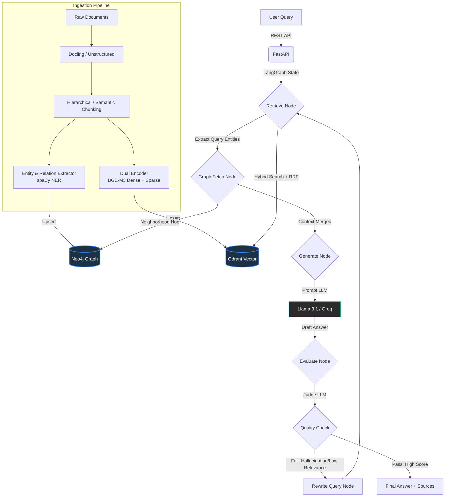

<div align="center">
  
  <h1>Enterprise Graph RAG Architecture</h1>
  <p>A production-ready Retrieval-Augmented Generation (RAG) system combining Dense Vector Search, Sparse BM25 Retrieval, and Knowledge Graphs powered by LangGraph.</p>

  <p>
    
    
    
    
    
    
    
    
    
  </p>
</div>

## 📌 Architecture Overview

This repository implements a highly sophisticated **Hybrid Graph RAG** engine. It mitigates LLM hallucination and improves retrieval accuracy for enterprise compliance and legal documents by combining the structural relationships of a Knowledge Graph with the semantic understanding of Vector embeddings.

### Flow Diagram



## 🚀 Key Features

- **Multi-Format Ingestion**: Parsers for PDF, DOCX, PPTX, XLSX, HTML, and Markdown using `Docling` and `unstructured`.
- **Intelligent Chunking**: Employs Hierarchical, Semantic (BGE-Small), and Sentence-Window strategies with Token limit adherence (`tiktoken`).
- **Dual-Encoder Hybrid Retrieval**: Fuses dense semantic search (Ollama BGE-M3) with sparse token retrieval (BM25 equivalents), reranked via Reciprocal Rank Fusion (RRF).
- **Cross-Encoder Re-ranking**: Uses `BAAI/bge-reranker-v2-m3` via `sentence_transformers` to drastically improve top-K context precision.
- **Graph RAG Layer**: Uses `spaCy` to construct a Knowledge Graph in Neo4j, enabling multi-hop logical relationship extraction (e.g., matching Contract Parties and Laws).
- **Agentic Orchestration**: Driven by `LangGraph`, featuring self-reflection, LLM-as-a-judge evaluation, and automatic query rewriting on failure.
- **Asynchronous Processing**: Non-blocking FastAPI backend offloads heavy document ingestion to `Celery` & `Redis`.
- **Observability**: Programmatic `Ragas` & `MLflow` evaluation suite, alongside `Prometheus` endpoint telemetry and `structlog` JSON logs.

## 🛠️ Technical Stack

- **Orchestration**: LangGraph, LangChain
- **APIs & Async Workers**: FastAPI, Uvicorn, Celery
- **Databases**: Qdrant (Vector), Neo4j (Graph), Redis (Cache & Broker)
- **Embedding & NLP**: BGE-M3 (via Ollama REST), spaCy (`en_core_web_lg`), FlagEmbedding (Cross-Encoders)
- **Monitoring**: Prometheus, MLflow, Structlog

## 📈 Recent Achievements
During the development of this project, we successfully accomplished the following key milestones:
- **Full Backend Pipeline Implementation**: Wired up the asynchronous Celery background workers to execute end-to-end processing (Parsing -> Chunking -> Graph Extraction -> Dual Encoding -> Database Upserts) without blocking the FastAPI endpoints.
- **Hugging Face Model Migration**: Upgraded from the deprecated LangChain community APIs to the modern `langchain-huggingface` architecture, ensuring stable, reliable inference against the `BAAI/bge-m3` endpoint.
- **LlamaIndex Compatibility Overhaul**: Implemented dynamic lazy-loading in our `ChunkerFactory` to gracefully bypass upstream breaking changes in `llama-index` while preserving our custom hierarchical chunking mechanisms.
- **Infrastructure Stability**: Resolved local Docker networking issues and Codespace disk space constraints to guarantee reliable, scalable deployments.

## ⚙️ Quickstart

### 1. Prerequisites
Ensure you have Docker and Docker Compose installed. You will also need Groq API credentials for the LLM.

### 2. Environment Configuration
Create a `.env` file in the root directory:
```env
# LLM Configuration
GROQ_API_KEY=your_groq_api_key_here
GROQ_MODEL_NAME=llama-3.1-70b-versatile

# Vector Store
QDRANT_HOST=qdrant
QDRANT_PORT=6333

# Graph Store
NEO4J_URI=bolt://neo4j:7687
NEO4J_USERNAME=neo4j
NEO4J_PASSWORD=password

# Embeddings & Backend
OLLAMA_BASE_URL=http://host.docker.internal:11434
REDIS_URL=redis://redis:6379/0
ENVIRONMENT=production
```

### 3. Deploy Stack
Bring up the entire stack using Docker Compose:
```bash
docker-compose up -d --build
```
This deploys the API, Celery Workers, Redis, Qdrant, Neo4j, and Prometheus.

### 4. API Endpoints

- **Ingest Documents**:
  ```bash
  curl -X POST http://localhost:8000/api/v1/ingest \
       -H "Content-Type: application/json" \
       -d '{"file_paths": ["/app/tests/fixtures/sample_docs/sample_pdf.pdf"]}'
  ```
- **Query the RAG**:
  ```bash
  curl -X POST http://localhost:8000/api/v1/query \
       -H "Content-Type: application/json" \
       -d '{"query": "What are the termination conditions for the Vendor in Exhibit B?"}'
  ```

## 📊 Evaluation & Metrics
Run the programmatic evaluation suite to test precision against a ground-truth dataset:
```bash
python -m lexrag.evaluation.runner --testset ./data/eval_testset.jsonl
```
Metrics (Faithfulness, Context Precision, Answer Relevance) are tracked automatically in local **MLflow**.
System metrics are exposed for scraping at `http://localhost:8000/metrics`.

---
*Built for extreme reliability, compliance extraction, and zero-hallucination enterprise environments.*
