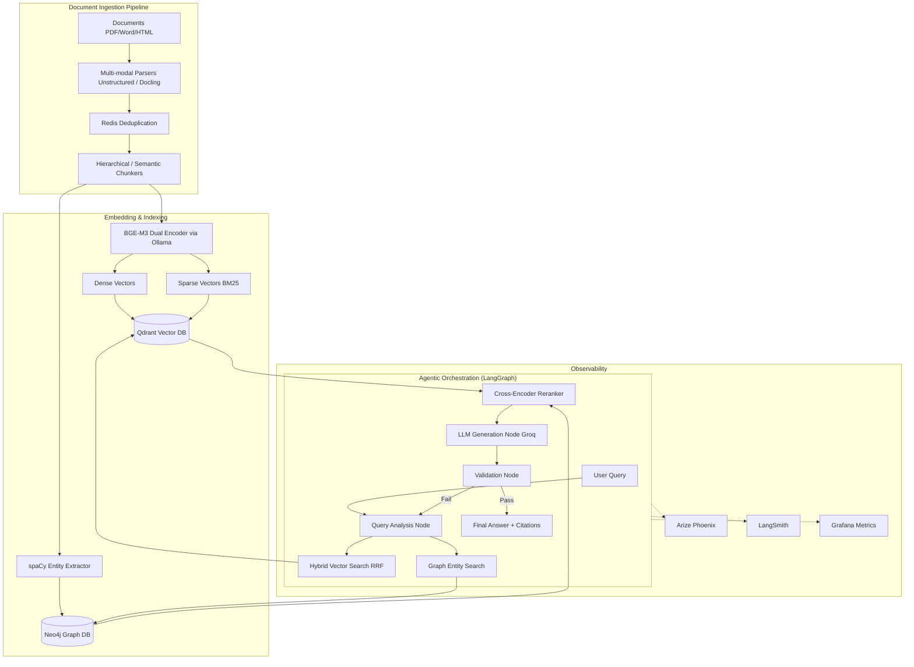

<div align="center">

# LexRAG — Enterprise Legal Document Intelligence Platform

[](https://www.python.org/downloads/)
[](https://fastapi.tiangolo.com)
[](https://qdrant.tech/)
[](https://neo4j.com/)
[](https://python.langchain.com/docs/langgraph)
[](https://groq.com/)
[](https://www.docker.com/)

An enterprise-grade Retrieval-Augmented Generation (RAG) system built from scratch, demonstrating deep mastery of the modern AI stack with hybrid search, graph reasoning, and production observability.

</div>

## 🏗️ Architecture



## ✨ Enterprise Features

- **Robust Ingestion**: Handles native PDFs, scanned PDFs (OCR fallback), Word, Excel, PowerPoint, and HTML. Includes Redis-based deduplication and SQLite failure logging.
- **Advanced Chunking**: Hierarchical (small-to-big) and semantic chunking using `tiktoken` for accurate token limits.
- **Hybrid Search**: Combines dense embeddings and BM25 sparse vectors using Reciprocal Rank Fusion (RRF).
- **Graph RAG**: Extracts entities and relationships via spaCy into Neo4j for multi-hop reasoning.
- **Cross-Encoder Re-ranking**: Uses BGE Reranker v2 to dramatically improve precision on the top-20 retrieved chunks.
- **Agentic Orchestration**: LangGraph-based state machine that self-corrects and iterates on ambiguous queries.
- **Production Observability**: Full OpenTelemetry tracing with Arize Phoenix, LangSmith, and Prometheus/Grafana metrics.

## 🚀 Quick Start

1. **Clone the repository**
   ```bash
   git clone https://github.com/Paramveersingh-S/Enterprise-RAG.git
   cd Enterprise-RAG
   ```

2. **Set up environment**
   ```bash
   cp .env.example .env
   # Edit .env to add your GROQ_API_KEY
   ```

3. **Start the infrastructure**
   ```bash
   docker compose up -d
   ```

4. **Install dependencies and bootstrap**
   ```bash
   make install-dev
   # Bootstrap commands will be run in later phases
   ```

## 🛠️ Tech Stack

- **Vector Database**: Qdrant
- **Graph Database**: Neo4j Community
- **Embeddings**: BGE-M3 (via Ollama local)
- **LLM**: Groq API (Llama 3.1 70B)
- **Orchestration**: LangGraph & LlamaIndex
- **API**: FastAPI, Celery, Redis
- **Evaluation**: RAGAS & DeepEval
